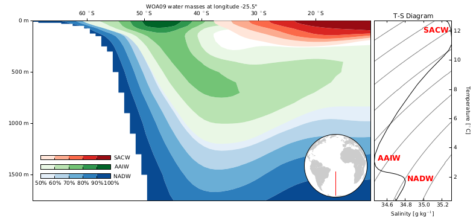

Entry 12
========

Authors
-------
- Filipe Pires Alvarenga Fernandes

Abstract
--------

The IPython notebook demonstrate how to calculate and plot the mixing
percentage of the three major `water masses`_ from the South Atlantic.

The data used is freely available, and consist of temperature and salinity
downloaded from the `World Ocean Atlas 2009`_.

The mixing percentage of each water mass is obtained by solving a linear system
of equations where we have 3 unknowns and three equations according to `Mamayev
(1975)`_:

:math:`m_1T_1 + m_2T_2 + m_3T_3 = T`

:math:`m_1S_1 + m_2S_2 + m_3S_3 = S`

:math:`m_1 + m_2 + m_3 = 1`

where,
- :math:`T, S` are the temperature and salinity data where we want to know the mixing rations;
- :math:`T_n, S_n` the temperature and salinity pairs for the water masses core 1, 2, and 3;
- :math:`m_1, m_2, m_3` the water mass mixing percentages we are looking for.

The water masses we will investigate are the: South Atlantic Central Water
`SACW`_ formed in the center of the South Atlantic Subtropical Gyre; the
Antarctic Intermediary Water `AAIW`_ formed in the Antarctic Convergence zone
originated by upwelling the North Atlantic Deep Water `NADW`_; and last but not
least the NADW, which is formed across the Greenland-Iceland-Scotland Ridge.
We could include more water masses in the analysis, for example: the Antarctic
Bottom Water `AABW`_ and/or the Circumpolar Deep Water `CDW`_.  However, that
would require two more equations, and therefore two more conservative
properties.  Temperature and Salinity are the easiest conservative variables to
compute.  Other variables like oxygen, silicate and etc could be used, but
would require a special treatment to became quasi-conservative to be included
in the analysis.

The contouring of the mixing percentages is a simple, yet powerful tool to
understand mixing the ocean.

Caveat: The water masses cores used here were modified and may not correspond
directly with the cores found in the `literature`_.  The reason for that was to
show both the Tropical Water and the South Atlantic Central Water as one water
mass.

The figure: Matplotlib allows us to contour the results with three separated
colormaps, facilitating the interpretation.  A world map inset shows the
transect (in red) of the data.  In additional, we plot the Temperature-Salinity
Diagram (T-S), to help visualize each the water mass center.  The T-S diagram
displays the seawater density (as gray contours) from lighter to heavier water
(at the top and at the bottom of the figure respectively) and the meridional
mean of the temperature and salinity.

interpretation: We can see that we have both AAIW and SACW cores (100%) in our
domain.  We can also note that, even though the SACW occupies the majority of
the T-S diagram range, it is not the major water mass in our domain.  Another
important remark is that the NADW reaches from the North Atlantic all the way
to the Antarctica, where it mixes with colder and fresher water to creates the
AAIW.  That is an important part to the global Conveyor Belt (or Thermohaline
Circulation).

The "white" gap at bottom the contour represents the AABW and the CDW that are
not resolved in our model.  The overlap of the contour is an evidence of a poor
choice for the water mass cores (probably bad choices for the water masses
cores).

.. _water masses: http://glossary.ametsoc.org/wiki/Water_mass

.. _World Ocean Atlas 2009: http://www.nodc.noaa.gov/OC5/WOA09/pr_woa09.html

.. _Mamayev (1975): http://www.elsevier.com/books/temperature-salinity-analysis-of-world-ocean-waters/mamayev/978-0-444-41251-5

.. _SACW: http://glossary.ametsoc.org/wiki/Central_water

.. _AAIW: http://en.wikipedia.org/wiki/Antarctic_Intermediate_Water

.. _NADW: http://en.wikipedia.org/wiki/North_Atlantic_Deep_Water

.. _AABW: http://en.wikipedia.org/wiki/Antarctic_Bottom_Water

.. _CDW: http://en.wikipedia.org/wiki/Circumpolar_deep_water

.. _literature: http://archimer.ifremer.fr/doc/00110/22090/19731.pdf

Products
--------

- :download:`PDF <mixing_ratio.pdf>`

Source
------

- :download:`IPython notebook <water_mass.html>` (:download:`ipynb <water_mass.ipynb>`)
