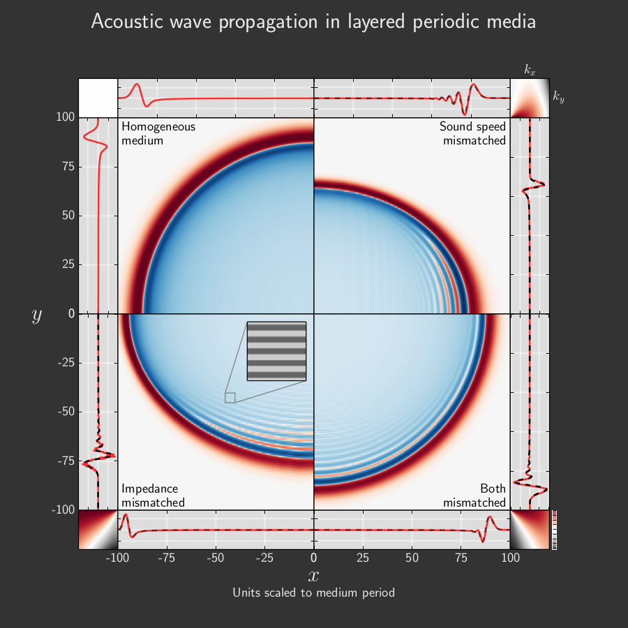

Entry 13
========

Authors
-------
- David Ketcheson
- Manuel Quezada de Luna

Abstract
--------

This figure presents results of simulations and analysis from the manuscript
"Two- dimensional wave propagation in layered periodic media", by Manuel
Quezada de Luna and David I. Ketcheson (submitted; pre-print `available`_).  It
shows how an initial Gaussian perturbation centered at the origin is propagated
in a medium consisting of alternating horizontal layers of two different
materials (the inset shows the structure of the medium). The four central plots
show the two-dimensional wave behavior, while the adjacent line plots show
traces of the solution along the lines :math:`x = 0` and :math:`y = 0`. Each
quadrant shows an experiment in a medium with different properties.

The top left plot shows the behavior in a homogeneous medium, consisting of an
expanding wavefront with no dispersion. This is shown simply for reference.

In the bottom left plot, the layers have identical sound speeds but different
impedances. Waves propagating in the vertical direction in this medium undergo
repeated reflection and exhibit dispersion as a result. This is evident in the
trace plot to the left, where the initial pulse has developed an oscillatory
tail. This effect is fairly well understood.

The main subject of the manuscript is depicted in the top right plot, where the
two layers have identical impedance, but different sound speeds. In this case
there is no reflection, but waves traveling horizontally undergo diffraction.
Remarkably, the large-scale effect of this diffraction is also to create an
effective dispersion, as seen in the horizontal trace above the plot.

Finally, the bottom right plot involves a medium in which both the impedance
and the sound speed vary. Effective dispersion is evident in both coordinate
directions. The reflective dispersion happens to be more pronounced in this
case, but in general either effect can be dominant, depending on the material
properties.

The main plots and the red traces are the results of finite volume simulations
of the variable-coefficient acoustic wave equation - with no dispersive terms.
In the manuscript, a high order effective medium dispersive wave equation is
derived by formal homogenization techniques. The black dotted lines are traces
computed by solving these effective medium equations. Excellent agreement is
observed in all cases.

Finally, the small plots in the corners show the effective dispersion relation
for each medium, based on the effective medium equations. The effective sound
speed is plotted as a function of the wavenumber components :math:`k_x, k_y` .
The axes of these plots are also oriented with the origin toward the center. As
suggested by the central plots, it can be seen from the dispersion relations
that low-frequency waves always travel fastest in the horizontal direction. But
for high-frequency waves, propagation in the vertical can be faster if there is
a large sound speed contrast and small impedance contrast.

Note that the straight horizontal lines that can be seen in some places are the
effect of the medium structure, and have nothing to do with grid resolution,
which is much too fine to be seen on the plot.

.. _available: http://arxiv.org/abs/1309.6666

Products
--------

- :download:`PDF <layered_media_dispersion.pdf>`

Source
------

- :download:`Python source <layered_media_plot.py>`
