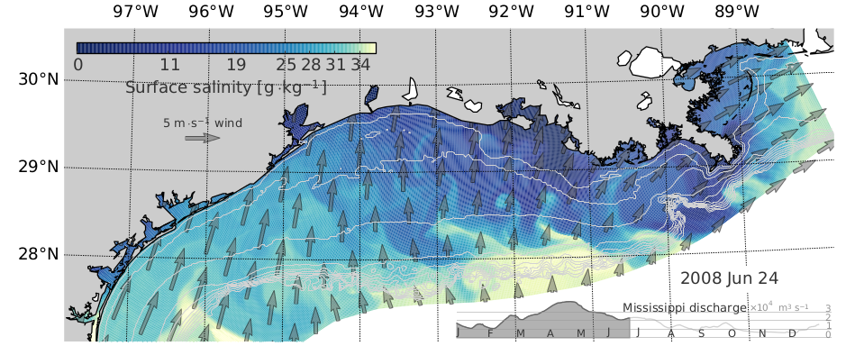

Entry 15
========

Authors
-------
- Kristen Thyng
- Rob Hetland

Abstract
--------

The Mississippi river plume is a dynamic feature on the Texas and Louisiana
continental shelves, and has a significant impact on the area. Low oxygen
conditions periodically occur in the summer, which can be harmful to sealife
and may be connected with river-borne nutrients. Additionally, the density
gradients introduced by the inflow of fresh water lead to complex circulation
patterns.

The fresher river water, shown in blues in the plot, can reach across the
shallow continental shelf in large eddies, between about -94 and -90 degrees.
These swirling flows can transfer the river water across the shelf break to
deeper waters, and bring saltier ocean water (represented in yellower colors)
back across the shelf from offshore. The shelf break, where the shelf gets
deeper most rapidly, starting around 100 meters depth, acts as a barrier to
transport across the shelf. The dynamics that can lead to cross-shelf
transport, then, are important for understanding the transport of materials
between the near- and far-shore regions. This is particularly significant for
understanding the transport of oil from offshore spills toward the coastline.

This figure shows the salinity of the Gulf of Mexico along the Texas and
Louisiana shelves at the surface from an ocean circulation model. The colorbar
shows the salinity, which uses a basic matplotlib colormap that has been
stretched to represent the logarithmic surface area of a river plume -- that
is, so that more of the range of salinities in the plume is visible in this
representation. Grey arrows are overlaid showing the wind, which is another
important forcing mechanism. The river discharge for the year of the
Mississippi river, the largest in the area, is shown in the bottom right, and
is filled up to the date of the figure for context.

Products
--------

- :download:`PDF <2008-06-24T00.pdf>`

Source
------

- :download:`Python source <cmPong.py>`

- :download:`Python source <salinity-plot.py>`

- Data files omitted by committee due to size constraints
