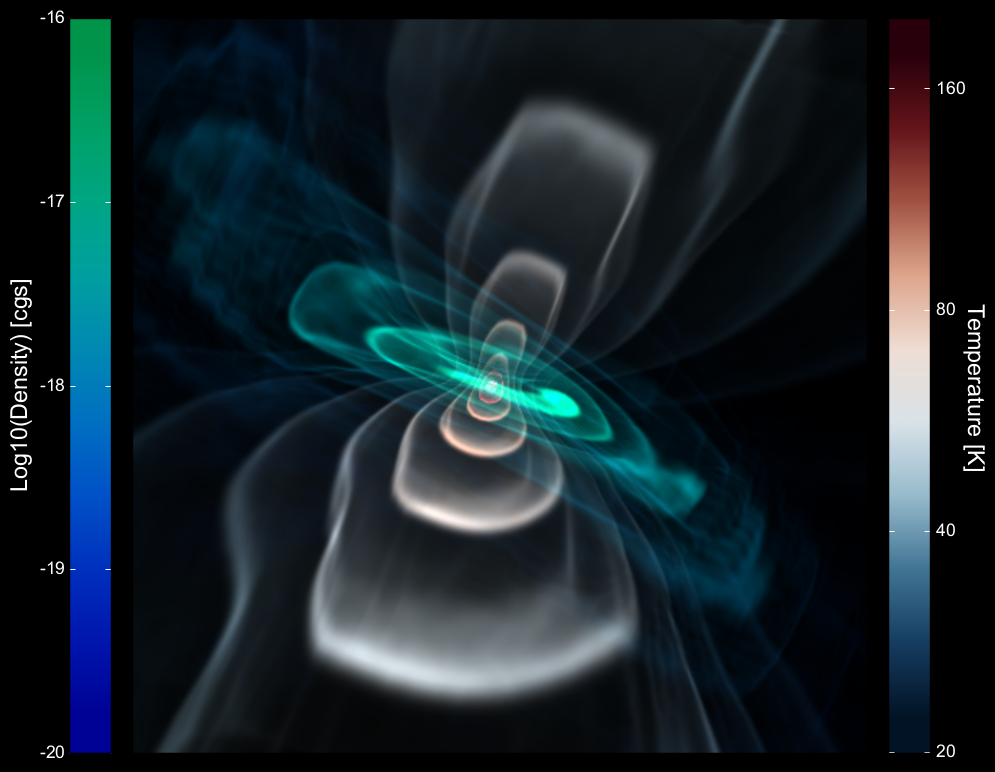

Entry 6
=======

`Animated <https://vimeo.com/70466967>`__

Authors
-------
- Thomas Robitaille

Abstract
--------

Understanding the formation of stars and planets can help us
understand how our own Solar system came into existence. Our current
picture of star formation is that turbulent motions and shocks in
large interstellar clouds of gas (mainly molecular hydrogen and
Helium) and dust (typically micron-sized carbonaceous and
silicate-based grains) cause peaks to form in the density structure,
which then become unstable to collapse under the influence of
gravity. As the material collapses, a protostar forms and material
then accretes onto it, mainly through an accretion disk. Later in
time, as the accretion from the large-scale envelope of gas and dust
slows down, planets may form in the disk surrounding the young star,
before the disk itself disappears, typically after a few million
years.

One way to gain further insight into these process is via numerical
simulations. These typically start from a large cloud of gas and dust,
and follow the evolution of the cloud under the influence of various
physical processes such as gravity, pressure, radiation, and so
on. This visualization shows an example of a star that has just
started to form in such a simulation. The density structure
highlighted in blue to green iso-contours shows that an accretion disk
has already formed. Using the density structure and the properties of
the forming star, I used `Hyperion <http://www.hyperion-rt.org>`__, a
Python and Fortran Monte-Carlo radiative transfer code to compute the
heating of the material, and derive the temperature structure. Because
the disk provides a shield for the radiation, the temperature is
highest along two ‘lobes’ that are perpendicular to the disk.  An
animated fly-around can be viewed `here <https://vimeo.com/70466967>`__.

The visualization of the density and temperature was done using `yt
<http://yt-project.org>`__, a Python package that can produce
state-of-the-art volume renderings, and the images for the density and
temperature were then combined in Python, before being plotted with
`Matplotlib <http://matplotlib.org>`__ along with two colorbars.  The
star formation simulation used as input for the density structure was
computed by Dr. Stella Offner (Yale).

Products
--------

- :download:`PDF <forming_star.pdf>`

Source
------

- :download:`Python source <scipy_2014_entry.py>`
