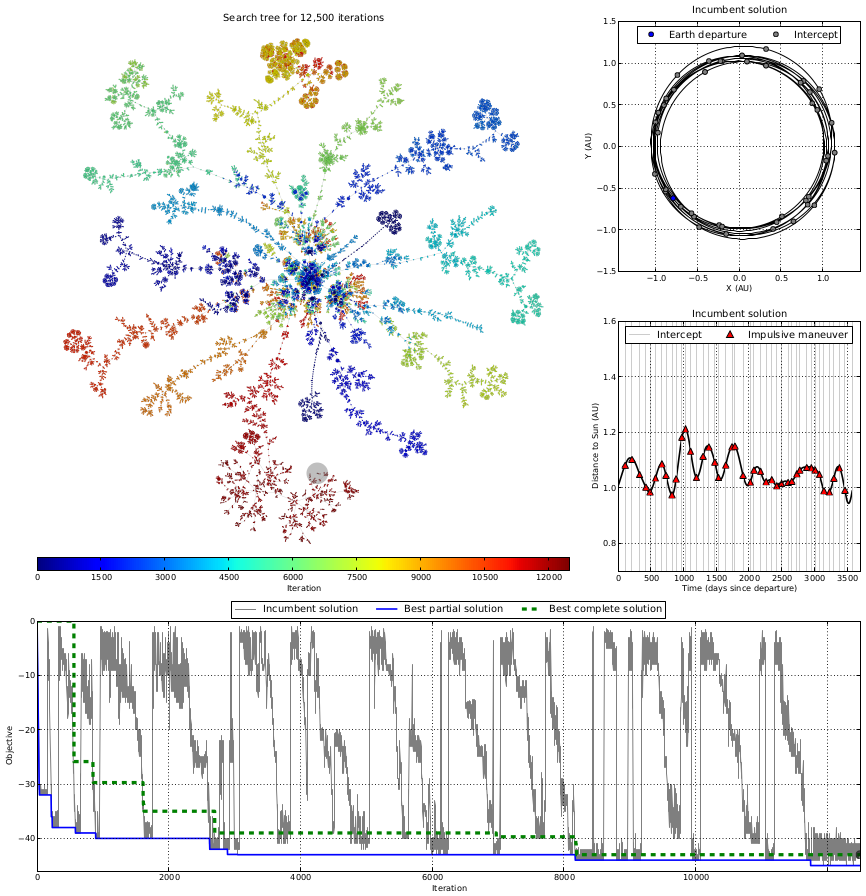

Entry 9
=======

`Animated <http://gregj.net/JHEPC/plots/iterations.webm>`__

Authors
-------
- Greg Johnson

Abstract
--------

The figure illustrates the search for optimal spacecraft tour
trajectories and is used in part of my dissertation research. The
problem shown is from the fourth annual `Global Trajectory
Optimization Competition <http://sophia.estec.esa.int/gtoc_portal/>`__
(GTOC4). The objective is to find trajectories visiting a maximum
number of near-Earth asteroids subject to spacecraft and timing
constraints. A tabu search algorithm is combined with a tree-based
solution representation to solve the problem.

At the beginning of the search, the tree consists of only a root node
corresponding to initial conditions of the spacecraft at Earth. At
each iteration, new solutions are constructed by adding nodes to the
tree, where each node represents a trajectory segment to a target
asteroid. A full trajectory is composed of a series of trajectory
segments that can be found as a path through the tree starting at the
root node. The search tree thus maintains a population of feasible
solutions and allows new solutions to be efficiently explored. The
exploration is guided by the tabu search algorithm which implements
strategic intensification, diversification and dynamic neighborhood
selection approaches.

The search tree is visualized according to a force directed graph
layout. The node coloring indicates the iteration at which a node is
added to the tree, with cool colors corresponding to early iterations
and warm colors corresponding to the latest. The incumbent solution of
the latest iteration is highlighted with a gray halo. The behavior of
the search is then apparent – the viewer can distinguish when the
search is intensifying in one region of the search space
(e.g. depth-first search) or maintaining a diverse exploration over
varying solutions, for example. This visualization has aided in the
design of dynamic neighborhood selection strategies to improve the
overall search performance.

An additional plot shows the objective history. The incumbent solution
objective is shown for each iteration, as well as the best found
solutions. A partial solution satisfies intermediate constraints of
the problem, while a complete solution also satisfies final
constraints and solves the original problem statement. The viewer can
correlate the performance with the search behavior shown in the search
tree. Finally, the incumbent solution is shown for the current
iteration in two plots showing its actual trajectory and properties.

This approach has found new solutions to the GTOC4 problem among the
best known. The runs here were computed on the Stampede supercomputer
at the Texas Advanced Computing Center. This solution methodology is
applicable to related problems such as orbital debris cleanup and
satellite servicing mission design that are the subject of future
research.

These plots are generated for each iteration of the search and
animated to better visualize the process. This animation is provided
`here <http://gregj.net/JHEPC/plots/iterations.webm>`__.

Products
--------

- :download:`PDF <iteration-12500.pdf>`

Source
------

- :download:`graph.py <graph.py>`

  Generates the graph view of the search tree and renders to PDF or
  PNG. Requires graph-tool.

- :download:`combined_plot.py <combined_plot.py>`

  Generates the matplotlib-based plots and the combined plot including
  the graph view of the search tree.

- `data.zip <http://gregj.net/JHEPC/data.zip>`__

  Archive containing graph DOT file, example layout, iteration history
  and incumbent solutions for several iterations.

- `More information <http://gregj.net/JHEPC/>`__
