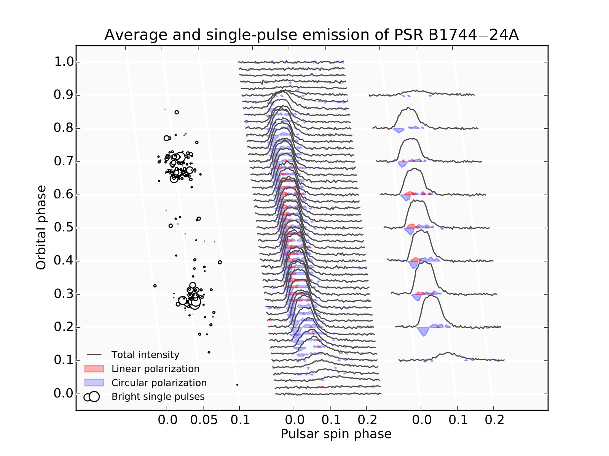

Entry 15
========

Authors
-------
- Anna Bilous

**Average and single­pulse emission of PSR B1744–24A**

Pulsars are one of the most exotic type of stars ever to be
identified: they are born in supernova explosions, when a dying star
leaves behind its rapidly spinning core, compressed to super-nuclear
densities. Astonishingly small by astronomical scales (10-20 km),
pulsars harbour ultra-strong magnetic fields and most of the time the
only way to see them is to catch the narrow beam of electromagnetic
radiation created by relativistic plasma in the pulsar's
magnetosphere. When this beam sweeps past the Earth, like the light
from a lighthouse, a pulse is detected. The thorough investigation of
these pulses provides a wealth of astrophysical information and can
even be used to test fundamental physical theories.

PSR B1744–24A (also known as Ter5A) was the first pulsar discovered in
globular cluster Terzan 5, a gravitationally bound agglomeration of
stars that orbits Galactic core as a satellite. Similarly to many
other pulsars, Ter5A at most times is too faint to be detected via
individual pulses.  However, the periodicity in incoming signal can be
assessed by indirect methods and once the spin period of a pulsar is
identified, so­called “average pulse” can be accumulated by folding
the data stream synchronously with the spin period.  The case of Ter5A
is further complicated by the fact that the pulsar belongs to a tight
binary system and the appearance of the average pulse is sometimes
affected by the propagation through the cloud of plasma which
surrounds the pulsar's companion. The center part of the plot shows
the evolution of the average pulse at radio wavelengths throughout one
orbit.  At the orbital phases 0.0 -- 0.1 and 0.9 -- 1.0 the pulsar is
eclipsed by its companion and close to eclipses the propagation
through the outer layers of companion star smears and delays observed
pulses.

Ter5A emission poses few questions which still await their
answers. One of them is the behaviour of linear polarization. In the
middle of orbital period, where pulsar is in front of the companion
and the pulsar radiation travels uninterrupted, the pulsar radio
emission has moderate, but distinct level of linear polarization (see
the inset on the right side with average pulses from selected orbital
phases). Interestingly enough, this linearly polarized emission
vanished in the vicinity of eclipses, but well before the shape of
profile or level of circular polarization changes.  Even more
puzzling, there have been spotted bursts of strong pulses (shown on
the left) which frame the disappearance of linear polarization.  These
pulses are so strong that we can detect them in original data, without
any averaging.  However, the fraction of such super-pulses is tiny and
they do not influence the average intensity or pulse shape. It is
currently unclear what makes these pulses so bright and how they are
connected to the disappearance of the linear polarization in the
average emission.  We hope that investigating this will shed some
light on the interaction of pulsar emission with companion's plasma
and the conditions in the binary system.

Products
--------

- :download:`PDF <Ter5A.pdf>`

Source
------

.. literalinclude:: Ter5A_source_code.py

.. literalinclude:: skew_projection.py

- :download:`Single_pulses.txt <Single_pulses.txt>`

- :download:`Average_emission.npy <Average_emission.npy>`
