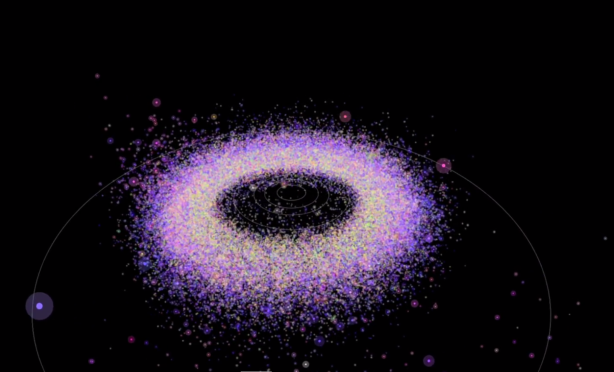

Entry 3
=======

`View video <https://vimeo.com/87092212>`__

Authors
-------
- Alex H. Parker

This series of 4000 figures is associated with `work I published in
2008 <http://adsabs.harvard.edu/cgi-bin/bib_query?arXiv:0807.3762>`__.

This animation shows the orbital motions of over 100,000 of the
asteroids observed by the Sloan Digital Sky Survey (SDSS), with colors
illustrating the compositional diversity measured by the SDSS
five-color camera. The relative sizes of each asteroid are also
illustrated. All main-belt asteroids and Trojan asteroids with orbits
known to high precision are shown. The animation is rendered with a
timestep of 3 days. The most surprising result of this animation is
that compositional gradient of the asteroid belt is clearly visible,
with green Vesta-family members in the inner belt fading through the
pink and yellow S-class asteroids to the blue C-class asteroids in the
outer belt, and onward to the deep red Trojan swarms beyond that. This
gradient is easily detected when plotting the belt in its component
orbital elements, but the fact that it appears in physical space as
well is neatly illustrated here. Occasional diagonal slashes that
appear in the animation are the SDSS survey beams; these appear
because the animation is rendered at near the survey epoch.

The work is rendered in matplotlib, and demonstrates how matplotlb can
produce semi-cinematic data visualizations (all the visualizations
`here <https://vimeo.com/alexhp>`__ are generated with matplotlib).

Instructions
------------

Running: Download `ADR4.dat
<http://www.astro.washington.edu/users/ivezic/sdssmoc/ADR4.dat>`__ and
place in working directory. On first run, ADR4_movie.py (below) will
build a (huge) database containing ‘moc_orbit’ objects.

For demo purposes, simply run it as: python ADR4_movie.py 0

This will render all the frames in sequence.

Products
--------

- `Video <https://vimeo.com/87092212>`__

Source
------

.. literalinclude:: ADR4_movie.py

- `Source data <http://www.astro.washington.edu/users/ivezic/sdssmoc/sdssmoc.html>`__
