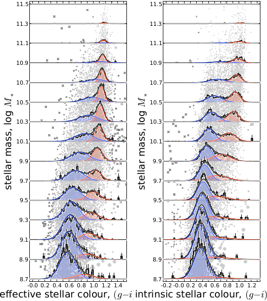
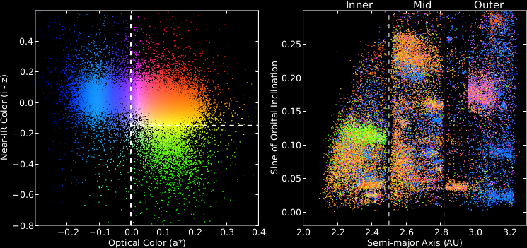

.. raw:: html

  

  

    <!-- Indicators -->
    <ol class="carousel-indicators">
      <li data-target="#carousel-example-generic"
          data-slide-to="0"
          class="active">
      </li>
      <li data-target="#carousel-example-generic" data-slide-to="1"></li>
      <li data-target="#carousel-example-generic" data-slide-to="2"></li>
    </ol>

    <!-- Wrapper for slides -->
    

.. raw:: html

      

        

.. raw:: html

        

        

          <h2>2013</h2>
          <h3>First place</h3>
        

      

.. raw:: html

      

        

.. image:: carousel/entry10.png

.. raw:: html

        

        

          <h2>2013</h2>
          <h3>Second place</h3>
        

      

.. raw:: html

      

        

.. raw:: html

        

        

          <h2>2013</h2>
          <h3>Third place</h3>
        

      

    

    <!-- Controls -->
    <a class="left carousel-control" href="#carousel-example-generic"
        data-slide="prev">
      
    </a>
    <a class="right carousel-control" href="#carousel-example-generic"
       data-slide="next">
      
    </a>
  

  

